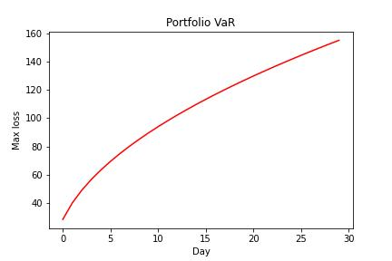

# Value at Risk
## Manage your portfolio’s risk with value at risk

Compute the value at risk (VaR) of a portfolio of stocks.

VaR is one way professional traders manage risk. It estimates how much your portfolio might lose over a set time period. Using VaR is a good way to avoid losing all your money if the market moves against you.

VaR lets you say something like this:

"With 95% confidence, my portfolio’s loss will not exceed $750 in one day."

As it turns out, most non-professional traders don’t use VaR. They either don’t know it exists or think it’s too complicated to use.

Using Python, I will compute VaR using the variance-covariance method.

---

**File:** [Portfolio VaR](PortfolioValueAtRisk.ipynb)

---

## Step 1: Import the libraries

    pandas

    numpy

    Scipy

    matplotlib

    yfinance

---

## Step 2: Read in data and Define the variables

In order to simulate a portfolio of stocks, it is essential to define the symbols, the weights, and the investment amount.

As well as the confidence level.

Picking the pairs to test is the secret behind a good portfolio. 
For this example however I will just use the FAANG stocks.

['META', 'AMZN', 'AAPL', 'NFLX', 'GOOG']

---

## Step 3: Compute portfolio statistics

Computing portfolio returns is not as simple as just adding up the returns of the individual stocks. We need to take the covariance between the stocks in the portfolio into account.

Fortunately, this is easy in Python using pandas and NumPy!

- compute daily returns of each stock
- compute the daily mean returns of each stock
- compute portfolio mean return
- mean of investment returns
- compute the portfolio covariance matrix
- compute portfolio standard deviation
- standard deviation of investment returns

---

## Step 4: Compute Value at Risk - VaR

To find the VaR of this portfolio, start by finding the point on the density plot based on the confidence level, mean, and standard deviation.

This is where scipy comes in.

ppf takes a percentage and returns a standard deviation multiplier for what value that percentage occurs at. It is equivalent to a one-tail test on the density plot.

The VaR is the portfolio value less this amount.

Next, calculate the VaR at the confidence interval

This is the most you can expect to lose in one day with 95% confidence.

---

## Step 5: Scaling VaR to different time frames

What about over one week? Or one month?

Stock returns increase with the square root of time. Therefore to scale the value at risk, we multiply it by the square root of time. This sounds scary but it’s simple in Python.

Multiply the one-day VaR by the square root of one (day) through the square root of 30 (days).

## Step 6: Plot VaR over time
